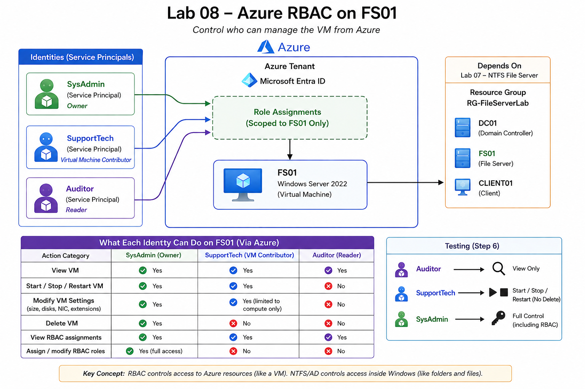
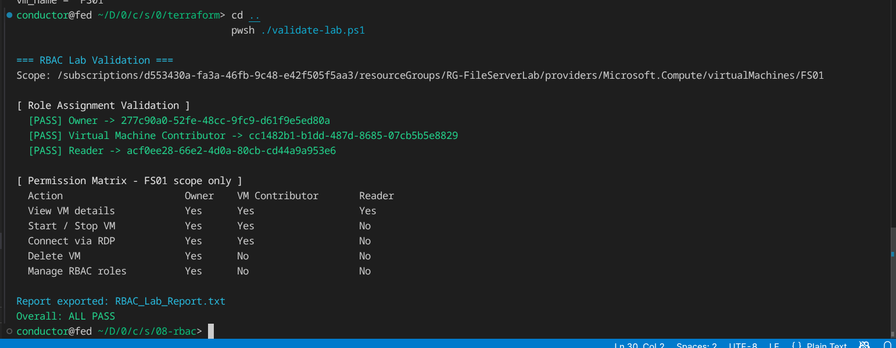
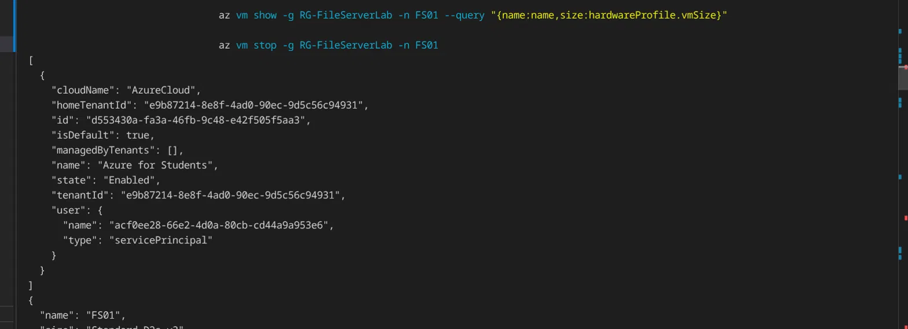
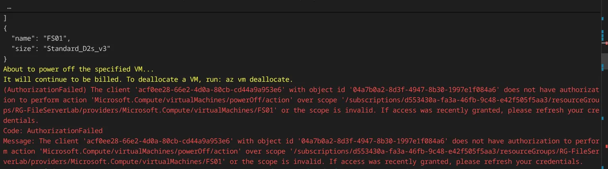
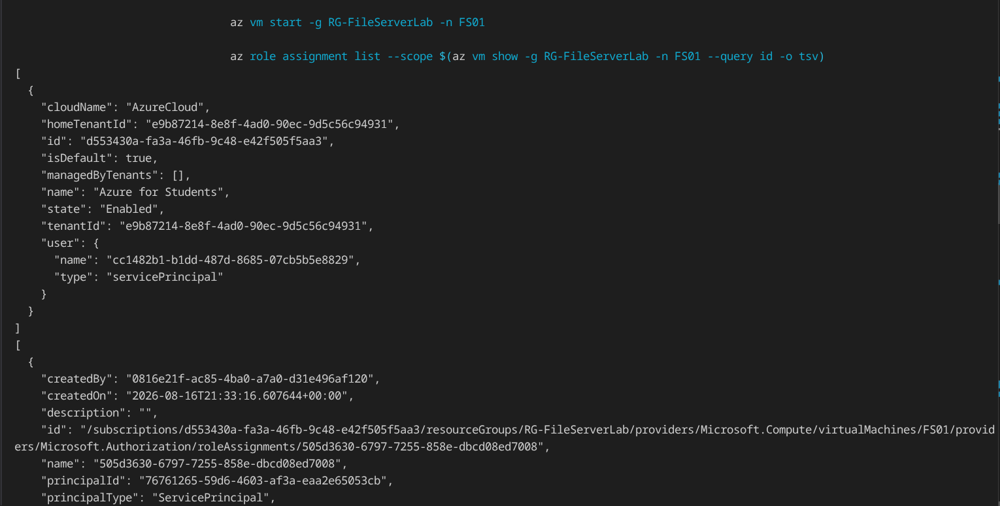
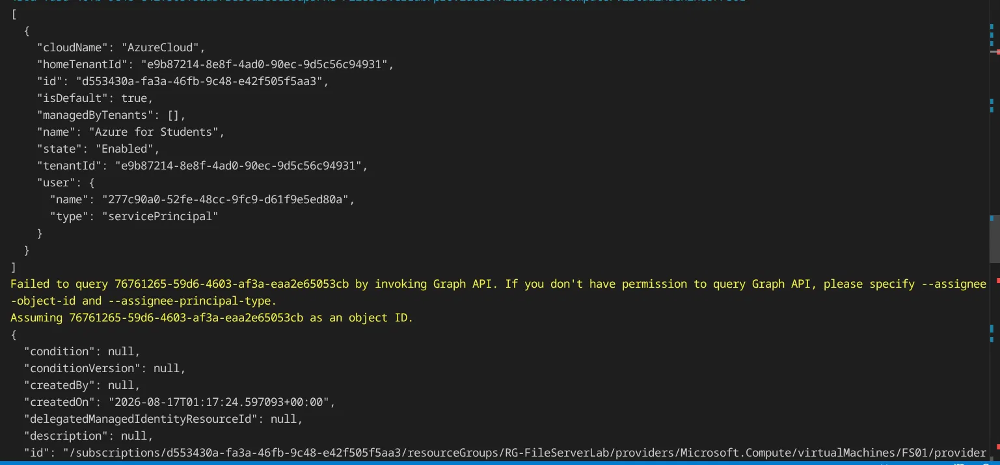
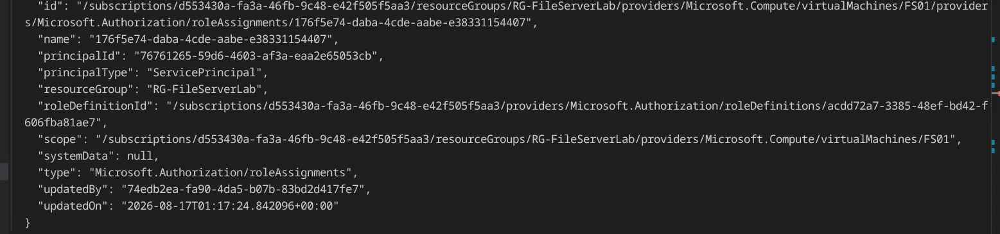

# 08 Azure RBAC Lab

**Azure RBAC · Service Principals · Terraform · PowerShell · Azure CLI**

---

## [▶️ Lab Walkthrough Video](https://www.loom.com/share/710773dbc9794ff68730777eba2e1b85)


## What This Lab Covers

This lab controls who can manage the FS01 virtual machine from Azure, separate from permissions inside Windows. My previous lab (07 NTFS file server permissions) controlled which departments could access specific folders on the file server. Azure RBAC controls a different layer: who can view, start, stop, delete, reconfigure, or manage access to the FS01 Azure VM resource.

I deployed three role assignments scoped directly to FS01, each tied to a Service Principal representing a different access level:

* **SysAdmin:** Owner
* **SupportTech:** Virtual Machine Contributor
* **Auditor:** Reader

Terraform reads FS01 as an existing resource rather than creating anything new. Every role assignment is scoped to FS01's exact Azure resource ID instead of the resource group, so these assignments do not grant equivalent access to DC01, CLIENT01, or other resources in the resource group.

The lab demonstrates least privilege scoping at the infrastructure level by limiting each assignment to one specific Azure resource. It also demonstrates why the actual permissions contained in an Azure role need to be evaluated rather than assuming its capabilities from the role name alone.

---

## Focus Areas

| Area | What I Did |
|---|---|
| **Azure RBAC** | Created three role assignments, Owner, Virtual Machine Contributor, and Reader, scoped to a single VM |
| **Identity** | Used Service Principals as test identities because the school tenant restricted creation of additional Entra ID users |
| **Terraform** | Used data sources to reference the existing FS01 VM without creating or managing the VM itself |
| **Scoping** | Pointed every role assignment directly at FS01's resource ID rather than the resource group |
| **Validation** | Queried Azure's live RBAC state separately from Terraform state |
| **Testing** | Authenticated as each Service Principal and tested actual Azure authorization boundaries |
| **State Management** | Used a separate Terraform state key for the RBAC deployment |

---

## Architecture



Three Service Principals were used as test identities, each mapped to one Azure built-in role and scoped directly to FS01.

### SysAdmin: Owner

Full management access to FS01, including:

* View the VM
* Start, stop, and restart the VM
* Reconfigure the VM
* Delete the VM
* View RBAC assignments
* Create and remove RBAC assignments

### SupportTech: Virtual Machine Contributor

Can manage the VM's compute resource, including:

* View the VM
* Start, stop, and restart the VM
* Reconfigure the VM
* Delete the VM
* View RBAC assignments

SupportTech cannot create, modify, or delete Azure RBAC role assignments.

### Auditor: Reader

Read-only access to FS01:

* View the VM and its configuration
* View RBAC information available through the Reader role

Auditor cannot perform VM management actions or modify RBAC assignments.

FS01, DC01, and CLIENT01 exist inside `RG-FileServerLab`. This RBAC project references the existing resource group and FS01 VM but does not create or manage those resources.

---

## RBAC vs. NTFS

Azure RBAC and NTFS permissions operate at different layers.

| | Azure RBAC | NTFS |
|---|---|---|
| **Controls** | Management of Azure resources | Access to files and folders inside Windows |
| **Enforced by** | Azure Resource Manager | Windows |
| **Example** | Whether an identity can stop FS01 | Whether a Finance user can open a Finance folder |
| **Scope in this lab** | FS01 Azure VM resource | File system objects inside FS01 |

A user having access to a folder inside Windows does not automatically give that user permission to manage the VM through Azure. Azure management access also does not automatically determine NTFS file permissions.

---

## Access Model

Each Azure RBAC assignment combines three things: Principal, Role, and Scope.

In this lab: Service Principal, Azure built-in role, and FS01 resource ID.

### FS01 Permission Matrix

| Action | SysAdmin (Owner) | SupportTech (VM Contributor) | Auditor (Reader) |
|---|:---:|:---:|:---:|
| View VM | ✅ | ✅ | ✅ |
| Start / Stop / Restart VM | ✅ | ✅ | ❌ |
| Manage / Reconfigure VM | ✅ | ✅ | ❌ |
| Delete VM | ✅ | ✅ | ❌ |
| View RBAC assignments | ✅ | ✅ | ✅ |
| Assign / modify RBAC roles | ✅ | ❌ | ❌ |

Virtual Machine Contributor includes broad VM management permissions. This includes deleting the VM and reading Azure authorization information, but it does not grant permission to create, modify, or delete RBAC role assignments.

---

## Build Stages

### 1. Confirm Dependencies

Confirmed that `RG-FileServerLab` and FS01 existed before deploying RBAC.

The RBAC project has its own Terraform state, but its role assignments depend on the existing FS01 resource because that VM's Azure resource ID is used as their scope.

---

### 2. Create Test Identities

The school-managed Azure tenant restricted creation of additional Entra ID users, so three Service Principals were used as test identities.

The Service Principals allowed Azure RBAC assignments and authorization boundaries to be tested without requiring additional human user accounts.

In a production environment, human administrators would normally authenticate with user identities, while Service Principals are commonly used by applications, scripts, automation, and other non-human workloads.

The three Service Principals were:

* SysAdmin
* SupportTech
* Auditor

---

### 3. Configure Terraform Variables

The Service Principal creation script returned the Object ID for each identity.

Those Object IDs were added to `terraform.tfvars`:

```hcl
sysadmin_object_id      = "<SysAdmin Object ID>"
support_user_object_id  = "<SupportTech Object ID>"
auditor_object_id       = "<Auditor Object ID>"
```

The existing resource names were also configured:

```hcl
resource_group_name = "RG-FileServerLab"
vm_name             = "FS01"
```

Azure RBAC role assignments use the Service Principal's Object ID, not its application/client ID.

---

### 4. Reference Existing Infrastructure

Terraform data sources were used to locate the existing resource group and FS01 VM:

```hcl
data "azurerm_resource_group" "lab" {
  name = var.resource_group_name
}

data "azurerm_virtual_machine" "fs01" {
  name                = var.vm_name
  resource_group_name = data.azurerm_resource_group.lab.name
}
```

The VM data source exposes FS01's Azure resource ID.

That ID becomes the scope for all three role assignments:

```hcl
scope = data.azurerm_virtual_machine.fs01.id
```

Because these are data sources, this project references the existing resources without creating or taking Terraform ownership of them.

---

### 5. Deploy RBAC

Terraform created three `azurerm_role_assignment` resources.

Example:

```hcl
resource "azurerm_role_assignment" "supporttech_vm_contributor" {
  scope                = data.azurerm_virtual_machine.fs01.id
  role_definition_name = "Virtual Machine Contributor"
  principal_id         = var.support_user_object_id
  principal_type       = "ServicePrincipal"
}
```

The same FS01 resource ID was used as the scope for all three assignments.

Deployment:

```bash
cd terraform

az login

terraform init
terraform plan
terraform apply
```

The Terraform plan showed exactly three resources to add, the three role assignments. No VM, networking, or other infrastructure was created.

---

## Terraform State

The RBAC project uses a separate Terraform state file from the infrastructure it references.

The states are stored in the existing Terraform state storage account using separate state keys.

```hcl
terraform {
  backend "azurerm" {
    resource_group_name  = "RG-TerraformState"
    storage_account_name = "tfstatentfslab07"
    container_name       = "tfstate"
    key                  = "08-rbac.terraform.tfstate"
  }
}
```

This keeps the RBAC deployment's state independent from the Terraform state that owns FS01 and the surrounding infrastructure.

Destroying the RBAC project therefore removes its Terraform-managed role assignments without treating FS01, DC01, CLIENT01, or the surrounding infrastructure as resources owned by this project.

---

## Automation

Two PowerShell scripts supported the lab.

### `00-create-test-users.ps1`

Creates the three Service Principals through the Azure CLI and retrieves the Object IDs required by Terraform.

The script also stores the credentials locally in a Git-ignored file so secrets are not committed to the repository.

### `validate-lab.ps1`

Queries Azure directly after deployment to verify the live RBAC assignments on FS01.

This separates two different questions: what resources did the infrastructure-as-code deployment create, versus what role assignments currently exist on FS01 in Azure right now.

RBAC changes can take time to propagate, so querying Azure directly provides an independent check of the deployed state.

---

## Verification

The lab was verified in two ways: automated validation of the live Azure RBAC state, and functional authorization testing while authenticated as each Service Principal.

### Validation

`validate-lab.ps1` queried the live role assignments on FS01 and confirmed:

* SysAdmin: Owner
* SupportTech: Virtual Machine Contributor
* Auditor: Reader

All three assignments were found at the expected FS01 scope.



---

### Auditor: Reader

Authenticated as the Auditor Service Principal.

Viewing FS01 succeeded:

```bash
az vm show --resource-group RG-FileServerLab --name FS01
```

Attempting to stop FS01 failed:

```bash
az vm stop --resource-group RG-FileServerLab --name FS01
```

Azure returned `AuthorizationFailed`. This confirmed that Reader could retrieve information about FS01 but could not perform VM management actions.




---

### SupportTech: Virtual Machine Contributor

Authenticated as the SupportTech Service Principal.

Starting FS01 succeeded:

```bash
az vm start --resource-group RG-FileServerLab --name FS01
```

SupportTech was also able to list the role assignments scoped to FS01. This is expected because Virtual Machine Contributor includes read access to Azure authorization information. SupportTech could therefore view who had access to FS01 but did not have permission to create, modify, or delete those RBAC assignments.



---

### SysAdmin: Owner

Authenticated as the SysAdmin Service Principal.

To test RBAC write access, SysAdmin created an additional temporary Reader assignment for SupportTech on FS01.

```bash
az role assignment create --assignee-object-id "<SupportTech Object ID>" --role "Reader" --scope "<FS01 Resource ID>"
```

The assignment succeeded. Among the three roles assigned in this lab, Owner was the only one with permission to create and remove role assignments.

The temporary Reader assignment was then deleted. The live RBAC state was checked again to confirm that only the Terraform-managed assignments remained.




---

## Security Decisions

Several controls were built into the lab intentionally:

* **Resource-level RBAC scope:** Assignments were applied directly to FS01 instead of `RG-FileServerLab` or the subscription.
* **Separate Terraform state:** The RBAC deployment uses its own state key.
* **Explicit identity inputs:** Service Principal Object IDs are provided explicitly to Terraform.
* **Secrets excluded from Git:** `terraform.tfvars`, Service Principal credentials, Terraform state, and other sensitive files are ignored.
* **Independent validation:** Live Azure state is queried separately from Terraform.
* **Temporary manual RBAC changes removed:** The role assignment created during testing was deleted afterward so Azure's live configuration returned to the Terraform-managed state.

---

## Troubleshooting

| Problem | Cause | Fix |
|---|---|---|
| `Set-ExecutionPolicy` error | `Set-ExecutionPolicy` is not available in PowerShell on Linux | Removed the command |
| Entra ID user creation failed | School tenant restricted creation of additional users | Used Service Principals as test identities |
| `terraform plan` found no configuration | Terraform command was run from the project root rather than the `terraform/` directory | Ran `cd terraform` first |
| `az vm list` did not show power state | Basic `az vm list` does not retrieve instance-view status | Added the `-d` flag |
| App ID used instead of Object ID | Service Principals expose multiple identifiers, but the role assignment requires the principal's Object ID | Retrieved and used the Service Principal Object ID |
| `az role assignment delete` rejected `--assignee-principal-type` | The argument is supported for role assignment creation but not deletion | Removed the unsupported argument and used the assignee Object ID |
| `.gitignore` patterns using `../` failed | Git ignore patterns do not traverse outside the directory containing the `.gitignore` | Moved repository-wide exclusions to the root `.gitignore` |
| `terraform destroy` required backend initialization | The local Terraform working directory needed to reconnect to its configured backend | Ran `terraform init -reconfigure` |
| Destroy prompted for `admin_password` | Terraform still evaluates required input variables during destroy | Supplied a temporary value satisfying the variable validation rules |

---

## Teardown

The RBAC role assignments were destroyed before the infrastructure they referenced.

### Remove RBAC Assignments

```bash
cd 08-rbac/terraform
terraform destroy
```

This removes the three Terraform-managed role assignments.

### Remove Infrastructure

```bash
cd ../../07-ntfs-file-server/terraform

terraform init -reconfigure
terraform destroy
```

After teardown, Azure was checked to confirm that the lab resource group had been removed while the Terraform state infrastructure remained.

---

## Tools & Technologies

* Microsoft Azure
* Azure RBAC
* Microsoft Entra ID
* Service Principals
* Terraform
* AzureRM Provider
* Azure CLI
* PowerShell
* Windows Server 2022
* Azure Blob Storage

---

## Key Technical Concepts Demonstrated

* Azure Resource Manager control-plane authorization
* Azure RBAC built-in roles
* Resource-level role assignment scoping
* Owner vs. Virtual Machine Contributor vs. Reader
* RBAC read permissions vs. RBAC write permissions
* Service Principal authentication
* Service Principal Object IDs vs. application/client IDs
* Terraform data sources
* Terraform remote state separation
* Live-state validation
* Positive and negative authorization testing
* Infrastructure-as-code state reconciliation
* Least-privilege scoping